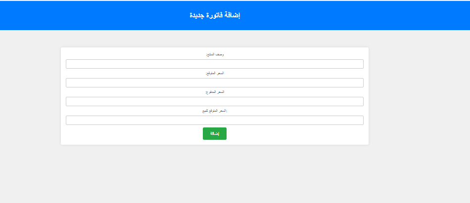
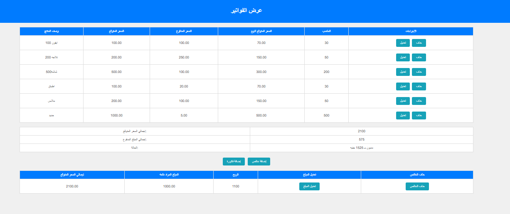
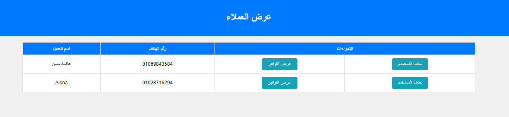

# Customs Invoices Project

Welcome to the Customs Invoices Project! This project is designed to help you generate and manage customs invoices efficiently using PHP, HTML, and CSS.

## Table of Contents
- [Introduction](#introduction)
- [Features](#features)
- [Technologies Used](#technologies-used)
- [Installation](#installation)
- [Usage](#usage)
- [Screenshots](#screenshots)
- [License](#license)

## Introduction
This project provides a web-based solution for creating and managing customs invoices. It's built with simplicity and ease of use in mind, ensuring that users can quickly generate accurate invoices for customs purposes.

## Features
- Generate customs invoices with detailed itemization
- Save and retrieve invoices from a database
- Print invoices in a clean and professional format
- User-friendly interface for managing invoices

## Technologies Used
- **PHP:** Server-side scripting language for handling backend logic
- **HTML:** Markup language for creating the structure of the web pages
- **CSS:** Stylesheet language for designing the appearance of the web pages

## Installation
To get started with the Customs Invoices Project, follow these steps:

1. Clone the repository:
    ```bash
    git clone https://github.com/yourusername/customs-invoices.git
    ```
2. Navigate to the project directory:
    ```bash
    cd customs-invoices
    ```
3. Ensure you have a local server environment set up (such as XAMPP, WAMP, or MAMP).
4. Place the project files in the appropriate directory for your server (e.g., `htdocs` for XAMPP).
5. Start your server and open the project in your web browser:
    ```http
    http://localhost/customs-invoices
    ```

## Usage
1. Open the application in your web browser.
2. Navigate to the "Create Invoice" page to start generating a new invoice.
3. Fill in the required details, including item descriptions, quantities, and prices.
4. Save the invoice to the database or print it directly.

## Screenshots
To give you a visual idea of what the project looks like, here are some screenshots:

### Home Page


### Create Invoice Page


### Invoice List Page


### Invoice Details Page



## License
This project is licensed under the MIT License.

---

Thank you for checking out the Customs Invoices Project! We hope it helps you manage your customs invoicing needs efficiently. If you have any questions or feedback, feel free to reach out.
